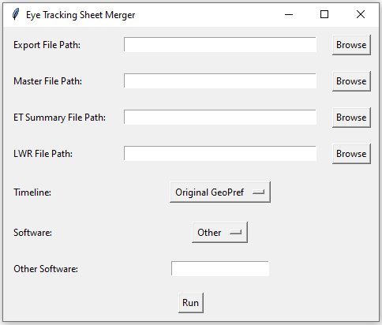
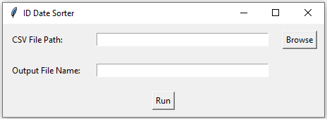
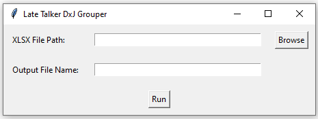
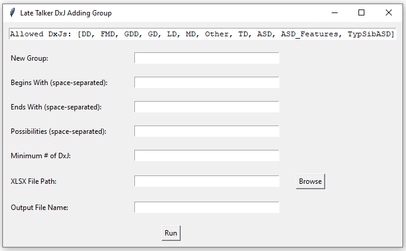
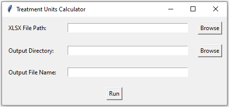
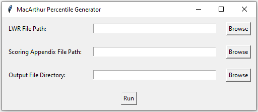

## Scripts for ACE Clinical Data Management

### Requirements

Scripts are written for Python 3.12+.

Install dependencies with:
```bash
pip install -r requirements.txt
```

or with Conda:
```bash
conda install --file requirements.txt
```

### Project Layout

The repository is now organized around the Shiny app while still keeping the original standalone workflows available:

```text
app.py
clinical_dm/
  processing/      # core Python processing logic
  shiny_app/       # Shiny UI and app services
docs/images/       # README screenshots
notebooks/         # exploratory notebooks
sample_data/       # local sample/test files
scripts/           # standalone tkinter launchers
www/               # Shiny static assets
```

### Run The Shiny App

Launch the unified Shiny app with:
```bash
python -m shiny run --reload app.py
```

The app lets users:
- choose any supported script from one interface
- upload the required inputs for that workflow
- run the script without opening separate tkinter windows
- download the most recent output directly from the app
- save all outputs to the local `outputs/` folder

### Run Standalone Launchers

If you still want the original desktop-style launchers, they now live in `scripts/`:

- `python scripts/UpdateEyeTracking.py`
- `python scripts/Flagger.py`
- `python scripts/Group.py`
- `python scripts/AddGroup.py`
- `python scripts/TreatmentCondensed.py`
- `python scripts/TreatmentCondensedWV.py`
- `python scripts/TreatmentHoursFull.py`
- `python scripts/MacArthurPercentiles.py`

### Eye Tracking Sheet Merger



Takes 4 files and aggregates the data according to the selected timeline, appending the result to the running master data sheet for the given test.

Steps:
1. Run `python scripts/UpdateEyeTracking.py`
2. Browse for desired exported data file
3. Browse for corresponding master sheet
4. Browse for most recent ET Summary sheet
5. Browse for most recent LWR sheet
6. Select the correct timeline
7. Select the software used for the exported data
8. Click `Run`

### Flagger



Sorts output form data by Subject ID and Visit Date, flagging each visit with the visit number.

Steps:
1. Run `python scripts/Flagger.py`
2. Browse for desired exported data file
3. Choose a filename without the extension
4. Click `Run`

### Group



Groups the late talkers data into categorized diagnostic groups:
- Always Typical
- Transient Language Delay
- Persistent Language Delay
- Persistent Global Delay
- LD to ASD
- Persistent ASD

Steps:
1. Run `python scripts/Group.py`
2. Browse for the original late talkers data sheet
3. Choose a filename without the extension
4. Click `Run`

### AddGroup



Allows the user to create a new diagnostic group in grouped late talkers data.

Steps:
1. Run `python scripts/AddGroup.py`
2. Enter the name of the new DxJ group in `New Group`
3. Enter desired first DxJs in `Begins With` or leave blank for all allowed DxJs
4. Enter desired last DxJs in `Ends With` or leave blank for all allowed DxJs
5. Enter desired possible DxJs between the first and last DxJ in `Possibilities` or leave blank for all allowed DxJs
6. Enter the minimum number of DxJs for the group in `Minimum # of DxJ`
7. Browse for the output sheet from `Group.py`
8. Choose a filename without the extension
9. Click `Run`

Example:
- `ASD Transition; FMD GD LD MD Other TypSibASD; ASD; FMD GD LD MD Other ASD TypSibASD; 2`

### Treatment Hours



Calculates the total or average number of units a subject has in a given treatment.

Steps:
1. Run `python scripts/TreatmentCondensed.py` or `python scripts/TreatmentHoursFull.py`
2. Browse for the desired treatment hours data sheet
3. Choose a filename without the extension
4. Click `Run`

### MacArthur Percentile Calculator



Populates the LWR with the most appropriate percentile by visit and section based on the MacArthur Bates ranking charts.

Steps:
1. Run `python scripts/MacArthurPercentiles.py`
2. Browse for the most recent LWR
3. Browse for the scoring appendix sheet
4. Browse for the desired output directory
5. Click `Run`
